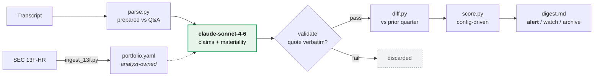

# Signal Radar

Monitors competitor earnings calls for signals that shift the view on a concentrated life sciences book, and delivers a ranked digest with every claim traceable to a speaker and a moment in the call.

---

## Run it

```bash
pip install -r requirements.txt
make demo
```

No API key. No network. Opens `out/digest.md` in about two seconds.

```bash
make eval     # precision/recall against a hand-labelled set, plus a threshold sweep
make test     # 11 tests, runs without pytest installed
make seed     # parse a 13F information table into a ranked portfolio seed
make run      # live extraction; needs ANTHROPIC_API_KEY and cached transcripts
```

To run live extraction you need transcript text, which this repo does not ship. See **Acquiring transcripts** below.

A pre-generated digest is committed at [`docs/sample_digest.md`](docs/sample_digest.md) — readable without running anything.

**Start here:** [`docs/worked_example.md`](docs/worked_example.md) is the case that justifies the system, written for a readout deck. [`docs/architecture.md`](docs/architecture.md) has the pipeline diagram.

## How it works



The model does one job: read passages and score each claim **in isolation**. Ranking, novelty, and linkage are deterministic and live in YAML an analyst can edit — see [`docs/architecture.md`](docs/architecture.md) for why that boundary is where it is.

---

## The problem, as I framed it

The brief says the research team misses material signals from competing company calls. Two things had to be decided before writing any code.

**What "important" means.** 13F gives dollar value and nothing else. Position size alone is a weak proxy for a concentrated fund, so `config/portfolio.yaml` composites four things: dollar value, weight as a share of the disclosed book, ownership as a percentage of shares outstanding, and near-term catalyst density. A name with a Phase 3 readout next quarter is more sensitive to competitor commentary than a name whose next event is in 2028.

The basis is stale and incomplete and the config says so: 13F is filed 45 days after quarter end, covers long US-listed equity only, and misses the private and venture book entirely. The file is a **curated artefact meant to be edited by an analyst**, not something auto-derived and trusted.

**Precision versus recall — the real design tension.** The brief says two things that pull against each other: the team *misses* signals (recall), and not every mention is worth interrupting an analyst over (precision). Collapsing these into one threshold gets both wrong.

So the pipeline splits them:

- **Extraction runs liberally.** Capture anything plausibly touching the portfolio. Over-capture is cheap.
- **Alerting runs conservatively.** Only high-scoring claims reach the top of the digest.
- **Nothing is deleted.** Below-threshold claims stay in `out/claims/*.json`, so a missed signal can be recovered and used to retune — which is the only honest way to approach recall without labelled ground truth.

At the configured threshold the eval reports **precision 0.71, recall 1.00** on the labelled set. That is a deliberate choice: an analyst dismisses a false positive in five seconds, but a missed competitive signal on a binary readout costs real money. Raising the threshold to 1.60 gives precision 1.00 at recall 0.80 — one line in `config/materiality.yaml` if the team prefers a quieter feed once it is in use.

---

## Design decisions

**Prepared remarks and Q&A are separated and weighted differently.** Prepared remarks are written by IR and reviewed by counsel. Q&A is where hedging, walk-backs, and unscripted competitive commentary live. Every one of the highest-scoring signals in the sample came from Q&A. Collapsing the call into one blob throws this away before the model sees it.

**Novelty is scored, not just materiality.** Companies recite the same talking points every quarter. Material means *what changed*. The diff (`diff.py`) catches figures that moved, dates that shifted, and — most usefully — **hedging that appeared where none was before**. In the sample it flags that Madrigal's F4c guidance acquired a new hedge between Q1 and Q2 while the stated date stayed at 2027. Without this the digest reprints the same five items every quarter and stops being opened.

Matching is lexical and entity-based rather than embedding-based, on purpose. Embeddings smooth over exactly the small edits that carry the signal: "in 2027" and "tracking toward 2027" are near-identical vectors and materially different statements.

**Silence is tracked.** A program discussed last quarter and absent this quarter is often the first observable sign of a deprioritisation, and it is invisible to anything that only reads what was said.

**Linkage is evaluated on mechanism and indication, not company name.** The dangerous competitor is the one not on the list. A company that never says "Madrigal" but reports FGF21 data in liver disease is a signal. This also survives acquisitions — when Novo Nordisk bought Akero, the mechanism rival did not disappear, it moved inside a mega-cap's call.

**Scoring is transparent and config-driven, not learned.** An analyst who disagrees with a ranking can open one YAML file, see which multiplier caused it, and change it. A tuned model that cannot be argued with does not get adopted, however good its AUC.

**A drug is not a string.** `config/aliases.yaml` resolves asset identity across internal codes, generic names, brand names, and licensor codes before any comparison is made. This was not theoretical: Madrigal called the Arrowhead siRNA `ARO-PNPLA3` in Q1 and `MGL-0795` in Q2 after in-licensing, and the diff reported a renamed asset as a deprioritised programme until the alias map existed. The same map collapses MASH/NASH and brand/INN pairs, and carries acquired assets across owners — efruxifermin now resolves to Novo Nordisk.

**Traceability is a hard requirement.** Every rendered signal carries speaker, section, verbatim quote, and passage index. Claims failing the verbatim check are discarded rather than repaired. Nobody acts on a model summary they cannot verify.

**Where the watchlist comes from.** `scripts/ingest_13f.py` parses an EDGAR 13F-HR information table and emits a ranked seed for `portfolio.yaml`:

```bash
python scripts/ingest_13f.py --xml data/13f/sample_information_table.xml --top 10
python scripts/ingest_13f.py --cik 1493215     # live from EDGAR
```

The script ranks on what a filing can actually support — market value and weight in the disclosed book — and emits explicit `TODO` fields for everything it cannot: shares outstanding, therapeutic area, mechanism, catalyst dates. It also detects whether `value` is reported in dollars or thousands, which changed with the Q4 2022 filings and silently moves every number by 1000x if assumed.

On the sample filing the top ten names are ~87% of the disclosed book. That concentration is the argument for ranking on weight rather than raw value.

**No IR-page scraping.** Verified across the watchlist: IR pages publish webcast players and PDF decks, not transcript text. Ten bespoke scrapers extracting text that is not there is the fastest way to spend the whole build on plumbing.

### Acquiring transcripts

The aggregator used to identify the seed transcripts returns **HTTP 403** to automated requests, and its terms prohibit programmatic reproduction of site content.

I did not work around it. Spoofing a user agent to defeat bot detection is not a data pipeline a fund should depend on, and the licensing question does not disappear just because the request starts succeeding. The manifest URLs in `fetch.py` are therefore **provenance** — they record exactly which document produced each cached extraction and stay checkable by hand — not a supported automated path.

Three supported paths, in order of preference:

| | Path | Notes |
|---|---|---|
| 1 | **Licensed API** — set `TRANSCRIPT_API_BASE` and `TRANSCRIPT_API_KEY` | What production should use. Terms permit storage. |
| 2 | **Manual import** — `python scripts/import_transcript.py saved.html --ticker MDGL --quarter "Q2 2026"` | Save the page in a browser; the script normalises vendor speaker formats into the parser's form. Adequate for a prototype. |
| 3 | **SEC EDGAR 8-K Ex-99** | Public domain, automated access permitted with an identifying UA. Prepared remarks only — never the Q&A, which is where most of this system's signal comes from. |

That last caveat is the whole argument for paying for a feed: the free, unambiguously licensed source is missing the half of the call that matters.

`make demo` needs none of this — it runs on cached extraction output.

**Not every company reports quarterly.** Assembling the manifest surfaced something a scheduler would get wrong: Inventiva is a French issuer and reports **semi-annually**. There is no "IVA Q2 2026" call — the most recent is FY2025 on 31 March 2026, and the next is 25 September 2026. Any coverage system that assumes four calls per name per year silently under-covers every European holding and then reports full coverage. Quarter labels in the manifest are the company's own reporting period, not a calendar quarter imposed on them.

**Vendor diarization fails, and it fails quietly.** In the Inventiva transcript the operator's turns are attributed to an analyst with a numeric suffix (`**Name, Analyst, Firm**0:`), with the same name reused for several different speakers. Two consequences, both handled in `parse.py`:

- The digits sit *outside* the bold markers, so the speaker regex failed to match and those lines were silently appended to the previous speaker's turn — misattributing operator boilerplate and analyst questions to whoever spoke last. That is a worse failure than a wrong label, because it corrupts the quote provenance the whole system rests on.
- Operator turns are therefore detected on **content**, not on the speaker label. Filtering on role alone would have let dial-in instructions through as analyst commentary and attributed questions to the wrong bank.

**Scope: biopharma depth over medtech breadth.** The brief covers medical technologies alongside biopharmaceuticals, and the watchlist carries PODD and ISRG. Every worked signal here is biopharma, and that was a deliberate call: with limited time, one indication cluster covered properly demonstrates more than two covered thinly.

The pipeline is not biopharma-specific. What changes for devices is the shape of the signal, not the machinery. Device competition surfaces as procedure volumes, installed base and attach rates, reimbursement and coding decisions, iteration cycles on an existing platform, and recall or field-action commentary — so `commercial_trajectory` and `competitive_positioning` carry most of the weight while `clinical_readout` carries little, since there is rarely a binary Phase 3 to slip. The `signal_types` weights in `config/materiality.yaml` are per-signal-type and would be tuned per sector rather than rewritten. Mechanism-based linkage maps onto platform and modality (CGM integration, closed-loop control, surgical robotics) the same way it maps onto a target class.

Extending to medtech properly means a second labelled eval set and sector-specific weights, not new code. It is a scoping decision, not a limitation of the design.

---

## Delivery

The output is a markdown digest intended to arrive as an email or Slack post before the open on call days. Not a dashboard — nobody logs into a dashboard to find out whether something happened.

The production shape is a scheduled job that runs after the close, commits the digest, and posts it. Roughly **$30 of inference per quarter** for the full competitor universe.

---

## What the eval does and does not measure

`eval/labeled_set.csv` is 20 hand-labelled passages with the labelling rationale committed alongside, so a reader can disagree with a specific call rather than with a number.

It measures whether **ranking** puts alert-worthy claims above the bar. It does **not** measure whether extraction found everything worth finding. That is recall, and 20 rows on one company cannot answer it.

`run_eval.py` prints both false positives and false negatives by name, with the reasoning. The two current false positives are both defensible-but-below-bar items — a repeated timeline guide and a business-development payment.

---

## Known gaps

- **The Q1 2026 fixture is reconstructed** from published summaries, not a parsed transcript. Enough to exercise the diff; explicitly excluded from the eval set.
- **Coverage is asserted, not verified.** The digest lists known blind spots, but the system does not yet check a calendar to know which calls it *should* have ingested.
- **Novo Nordisk-class calls are low signal-to-noise.** Two sentences of MASH commentary inside a call dominated by obesity and diabetes; needs section-targeted retrieval rather than whole-call extraction.

---

## What I would build next

1. **Coverage reconciliation** — pull the earnings calendar for the competitor universe and report which calls happened that were not ingested. A monitoring system that cannot say what it missed invites false confidence.
2. **Analyst feedback loop** — a useful/not-useful control on each signal, feeding few-shot examples back into the extraction prompt. Threshold tuning by hand does not scale past one person's taste.
3. **Extend the alias map into a real registry** — `config/aliases.yaml` is hand-maintained and covers the sample. A production version resolves programme identity from a reference dataset rather than a YAML file an analyst edits.
4. **Let the claim store become a graph.** Deliberately *not* a build-it-first item. Two layers already exist: `aliases.yaml` is a node registry with alias, `owner`, and `former_owner` edges that carry assets across acquisitions, and every extracted claim already carries `entities: {drugs, mechanisms, indications, trials, companies}` — which is triple-shaped. Run the pipeline across sixty companies for four quarters and the temporal graph of who said what about which asset, when, exists without further work.

   What it would then buy that the flat config cannot: **multi-hop reachability**. "Which holdings have exposure to a mechanism a competitor just reported positive data on" is one traversal on a graph and a hand-written special case today. Same for transitive competitive discovery — a competitor in-licenses an asset whose mechanism touches a holding no ticker-based rule would ever have connected.

   What it would not buy: better extraction, better materiality judgement, or anything at all at the current scale of 10 holdings and a handful of transcripts. The trigger is roughly **50+ companies and 4+ quarters of accumulated claims**, at which point hand-maintaining the competitive edges in `portfolio.yaml` stops being tractable. Building it before that threshold is infrastructure looking for a problem.
5. **Backtest against price** — flagged signals versus subsequent 1- and 5-day moves in the affected holding. Deliberately deferred: a sloppy version is worse than none, because the confounders in a single quarter are severe and a spurious hit rate would be quoted back for months.
6. **Broader event coverage** — investor days and medical conferences (AASLD, EASL). Different formats, and in this indication often where the data actually lands.
7. **Real transcript feed** — a licensed source with an SLA, replacing the aggregator.

---

## Layout

```
config/portfolio.yaml      watchlist, importance rationale, mechanism/indication edges
config/materiality.yaml    scoring weights, thresholds, signal taxonomy
config/aliases.yaml        asset/indication/mechanism identity resolution
scripts/ingest_13f.py      EDGAR 13F -> ranked portfolio seed
prompts/extract_claims.md  the extraction prompt — where domain judgment lives
scripts/import_transcript.py  normalise a saved transcript into the cache
src/signal_radar/
  parse.py                 speaker tags, prepared/Q&A split, chunking
  extract.py               LLM -> validated structured claims; replay mode
  diff.py                  quarter-over-quarter novelty and hedge detection
  score.py                 materiality scoring, alert/watch/archive partition
  report.py                digest rendering
  fetch.py                 transcript acquisition and cache
  cli.py                   pipeline entrypoint
eval/                      labelled set + evaluation runner
docs/architecture.md       pipeline diagram and the model boundary
docs/worked_example.md     the case that justifies the system
```

---

## Data & licensing

All inputs are public disclosure — 13F filings and published earnings call transcripts. No MNPI, no expert networks.

**Transcript text is not committed.** It is third-party licensed content; `data/transcripts/` is gitignored and populated by `make fetch`. What ships in the repo is cached *extraction output* — structured claims with short verbatim quotes for audit.
