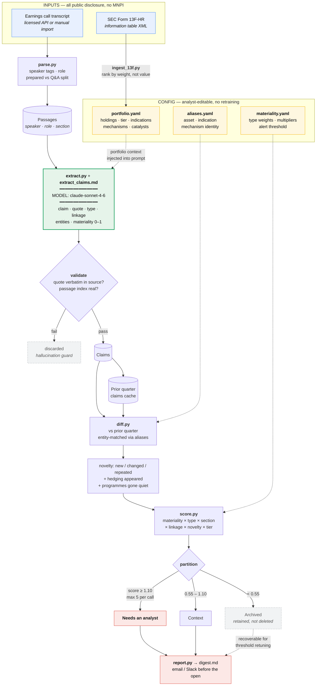
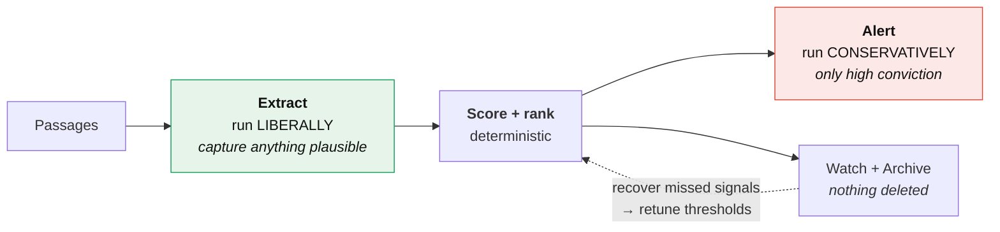
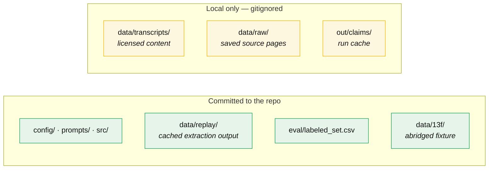

# Architecture

## Pipeline

## Where the judgment lives

The model does one job: read passages and emit structured claims with a
materiality score for each claim **in isolation**. It is not asked to rank, to
compare quarters, or to decide what interrupts an analyst.

Everything downstream of the model is deterministic and config-driven:

| Stage | Deterministic? | Why it sits outside the model |
|---|---|---|
| Section weighting | yes | Prepared vs Q&A is a structural fact, not a judgment call |
| Novelty | yes | Requires the prior quarter, which the model never sees |
| Linkage strength | yes | Follows from `portfolio.yaml`, which an analyst owns |
| Ranking | yes | An analyst who disagrees must be able to change one YAML line |

This is the difference between a system a research team adopts and one they
argue with. A tuned end-to-end model that produces a ranking nobody can
interrogate does not get used, however good its AUC.

## The precision / recall split

The brief states two things that pull against each other: the team **misses**
signals, and not every mention is worth **interrupting** an analyst over. One
threshold cannot serve both.

Over-capture is cheap; a missed competitive signal on a binary readout is not.
So extraction is generous and alerting is strict, and the gap between them stays
on disk rather than being thrown away — which is the only honest way to approach
recall when there is no labelled ground truth.

Measured on the labelled set at the configured threshold: **precision 0.71,
recall 1.00**. Raising the threshold to 1.60 gives precision 1.00 at recall 0.80.
That is one line in `config/materiality.yaml`.

## Data boundaries

Transcript text is never committed. What ships is *extraction output* — claims
with short verbatim quotes for audit — which is why `make demo` runs with no
API key, no network, and no licensed content in the repository.
